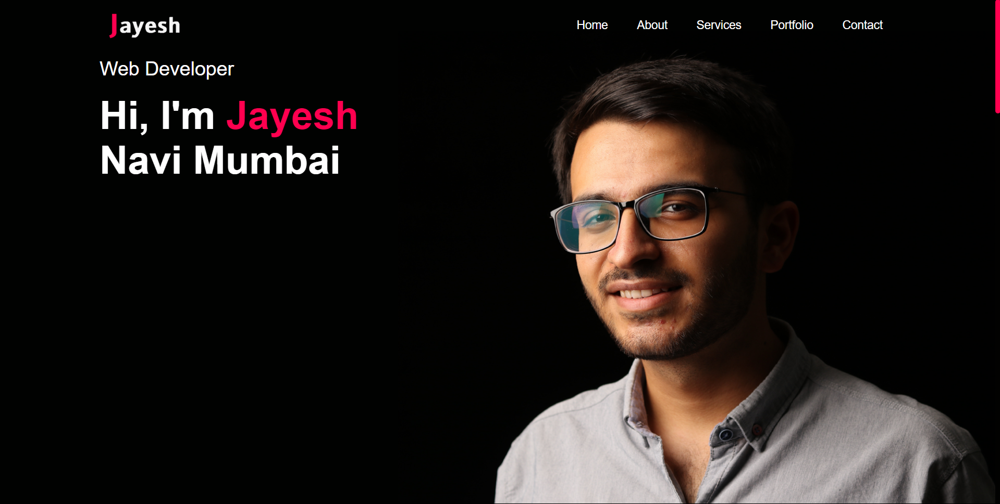
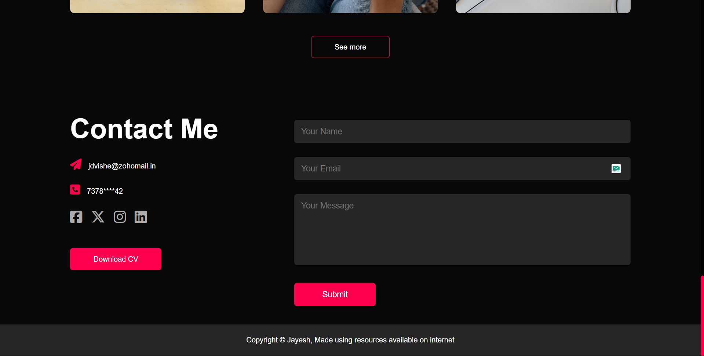
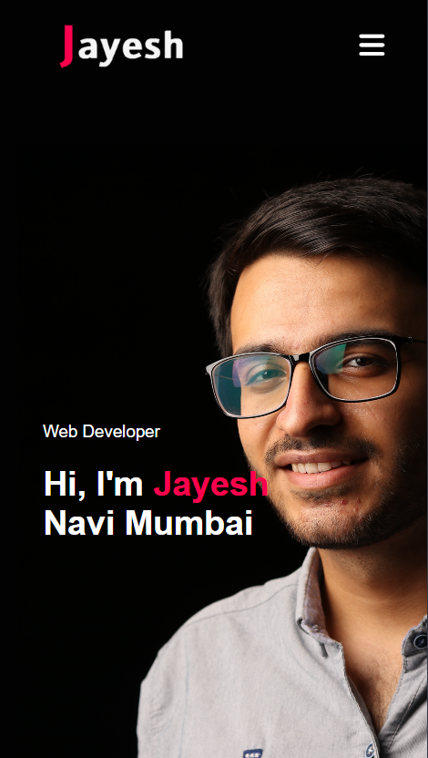

# Portfolio

Welcome to my personal portfolio! This portfolio is designed to showcase my personal details, education, professional experience, the services I offer, and provides an easy way to get in touch with me.

## Table of Contents
- [About](#about)
- [Features](#features)
- [Technologies Used](#technologies-used)
- [Contact](#contact)
- [Contact Details Handling](#contact-details-handling)
- [Project Screenshots](#project-screenshots)

## About

This portfolio highlights my journey as a developer, including my educational background, the projects I've worked on, and the services I provide. It offers a comprehensive overview of my skills and experience, giving potential clients and collaborators a clear understanding of what I do.

## Features

- **Home Page:** An introduction with a brief overview of my skills and expertise.
- **About Section:** Detailed information about my education and professional experience.
- **Work/Projects Section:** Displays some of the projects I have worked on, with links for more information.
- **Services Section:** A list of the professional services I offer.
- **Contact Page:** A form that allows visitors to easily reach out to me for inquiries or collaborations.

## Technologies Used

- **HTML5** for structure
- **CSS3** for design and layout
- **JavaScript** for interactivity and functionality

## Contact

Feel free to reach out through the contact form on the portfolio, or email me directly at:  
**Email:** vishejay77@gmail.com

## Contact Details Handling

When users submit their contact information and messages through the contact form, the data is securely stored in a Google Sheet. This allows me to keep track of inquiries and respond promptly.

## Project Screenshots

Here are some screenshots of the project:

